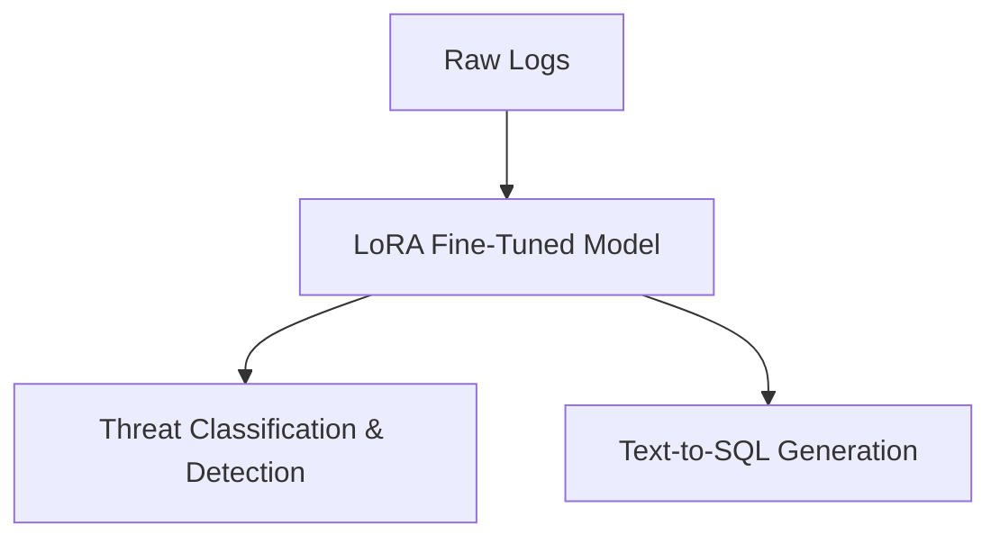
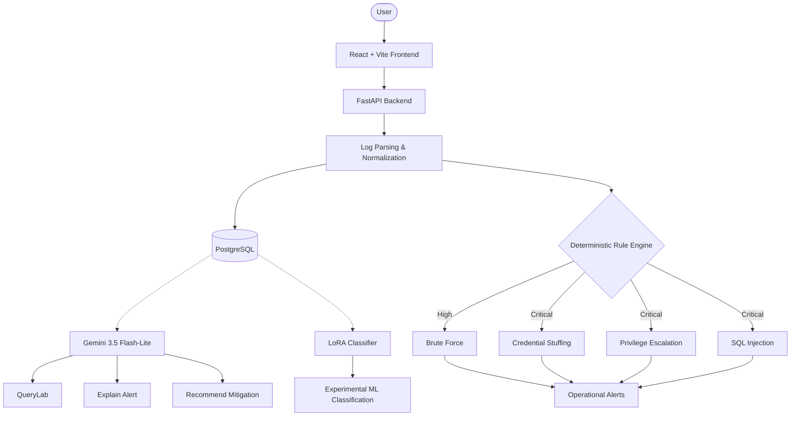

# LogHunt AI — Phase I vs Final Comparison

**Hybrid LoRA-Based Cybersecurity Analytics Assistant**
MVJ College of Engineering — Academic Year 2025–2026

## 1. One-Minute Summary

**PHASE I (Proposed):**

- A single LoRA-fine-tuned LLM was proposed as the central intelligence.
- It was intended to handle log understanding, threat classification/detection, and text-to-SQL all by itself.

**FINAL (Implemented):**

- The architecture became hybrid because a purely ML-based approach was not reliable enough for operational security alerting.
- **Deterministic Rule Engine:** Handles reliable operational threat detection and alert generation during ingestion.
- **Gemini AI:** Handles QueryLab (text-to-SQL), Explain, and Recommend features.
- **LoRA ML:** Remains as an experimental classification feature, separated from live alerting.
- **Infrastructure:** PostgreSQL (via Docker Compose) stores data, and React + Vite powers the frontend.

**Why the change?**
During implementation and evaluation, the ML-only approach (especially for SQL Injection) proved too unpredictable for critical security alerts. Responsibilities were separated so each component handles what it does best: rules for reliability, generative AI for investigation, and ML for experimental classification.

## 2. Before vs After Architecture

### A. Phase I — Proposed Architecture

_Note: This represents the original concept, not what was actually built._

### B. Final — Implemented Architecture

_(Notice that LoRA is no longer responsible for generating operational alerts.)_

## 3. Biggest Changes From Phase I to Final

1. **ML-only concept → Hybrid architecture**
   - _Proposed:_ LoRA LLM does everything.
   - _Final:_ Rule engine for alerts, Gemini for queries, LoRA for ML experiments.
   - _Why:_ ML classification was not reliable enough for dependable operational threat detection.
2. **Generic log handling → Actual implemented parsers**
   - _Proposed:_ Mentioned logs generally.
   - _Final:_ Implemented specific Apache, Syslog, and JSON parsers.
   - _Why:_ Real systems require strict format handling before analysis.
3. **Single-format assumption → Mixed-format line-by-line parsing**
   - _Proposed:_ Assumed pre-cleaned log files.
   - _Final:_ The system detects formats per-line and gracefully cascades through parsers.
   - _Why:_ Real-world uploads often contain mixed or garbled lines.
4. **ML-based operational detection → Deterministic rule engine**
   - _Proposed:_ ML classifies threats.
   - _Final:_ Keyword, regex, and time-window threshold rules generate alerts.
   - _Why:_ Deterministic rules are predictable, explainable, and testable.
5. **SQL Injection became a dedicated operational rule**
   - _Proposed:_ Only mentioned generically.
   - _Final:_ A critical operational rule triggers on explicit SQL payload patterns.
   - _Why:_ SQLi is a critical threat pattern where predictable matching is important, while the ML model failed to classify this class reliably.
6. **LoRA became an experimental classifier**
   - _Proposed:_ The core alerting engine.
   - _Final:_ A separate, manual analysis playground.
   - _Why:_ It allows demonstration of the ML research without breaking the core application's reliability.
7. **Proposed Text-to-SQL → Gemini-powered QueryLab with safety validation**
   - _Proposed:_ LoRA generates SQL.
   - _Final:_ Gemini generates SQL, protected by 2 layers of security constraints.
   - _Why:_ An external frontier model (Gemini) handles natural language better, and security layers are required to prevent destructive queries.
8. **SQLite/MySQL option → PostgreSQL via Docker Compose**
   - _Proposed:_ Left open as SQLite/MySQL.
   - _Final:_ PostgreSQL 16 running in a reproducible Docker Compose container.
   - _Why:_ PostgreSQL handles complex queries better, and Docker makes setup reproducible.
9. **Proposed interface → React + Vite + Tailwind**
   - _Proposed:_ Streamlit or Flask mentioned.
   - _Final:_ A modern Single Page Application (SPA).
   - _Why:_ React provides a vastly superior, dynamic user experience for dashboards and data tables.

## 4. Main Comparison Table

| Area                       | Phase I (Proposed)                      | Final Implementation                                                                     | Why / Improvement                                                                     |
| -------------------------- | --------------------------------------- | ---------------------------------------------------------------------------------------- | ------------------------------------------------------------------------------------- |
| **Core Detection**         | LoRA-based central intelligence.        | Deterministic rule engine.                                                               | More predictable, testable, and explainable operational detection.                    |
| **ML / LoRA**              | The main engine for the system.         | Experimental, non-alerting feature.                                                      | ML evaluation showed unreliability (esp. SQLi); separated to prevent false negatives. |
| **Log Parsing**            | Unspecified generic data processing.    | Concrete Apache, Syslog, and JSON parsers.                                               | Required to extract structured fields (IP, username) for accurate rules.              |
| **Mixed-Format Ingestion** | Assumed single-format pre-cleaned data. | Auto-fallback format detection per line.                                                 | Allows users to upload messy, real-world log dumps safely.                            |
| **Threat Detection**       | ML classification categories.           | 4 explicit rules: Brute Force, Credential Stuffing, Privilege Escalation, SQL Injection. | Provides predictable detection for the supported attack patterns.                     |
| **SQL Injection**          | Generic concept.                        | Operational regex rule (Critical severity).                                              | ML failed this class entirely; a rule was required for safety.                        |
| **Privilege Escalation**   | Generic concept.                        | Deep regex extraction of `sudo` logs.                                                    | Allowed precise tracking of elevated user actions.                                    |
| **QueryLab**               | Handled by LoRA LLM.                    | Handled by Gemini 3.5 Flash-Lite.                                                        | Frontier models perform text-to-SQL much better than small local models.              |
| **Security (QueryLab)**    | Not specified.                          | Layer 1 (Intent Guard) & Layer 2 (SQL Validator).                                        | Prevents prompt-injection and destructive database edits (Drop/Delete).               |
| **Database**               | SQLite or MySQL.                        | PostgreSQL via Docker Compose.                                                           | Better JSON/analytics support and highly reproducible for teammates.                  |
| **Frontend**               | Streamlit or Flask web interface.       | React + Vite + Tailwind.                                                                 | Provides a modern, responsive, and dynamic analytics dashboard.                       |
| **Testing**                | Unspecified.                            | Automated tests, curated demo datasets.                                                  | Ensures the system is defensible during evaluation.                                   |

## 5. SQL Injection: Two Different Mechanisms

LogHunt AI has TWO distinct SQL Injection concepts. It is critical not to confuse them:

### Operational SQL Injection Detection

- Deterministic, rule-based detection.
- Runs automatically during log ingestion.
- Searches for explicit SQL injection patterns (e.g., `UNION SELECT`, `' OR 1=1`).
- Generates `sql_injection` alerts with `Critical` severity.
- **This is the operational SQL Injection detection mechanism and was successfully verified against the project's test cases.**

### ML SQL Injection Classification

- The experimental LoRA classifier model.
- Evaluated with an **F1 score of 0.00** for SQL Injection.
- _Why?_ Training data was extremely limited for this class (only 21 examples). Additionally, there is a domain mismatch between the CICIDS2017 network-flow training data and our application-log inference domain.
- ML SQL Injection predictions are therefore unreliable.

**IMPORTANT:**
The F1 = 0.00 score applies _only_ to the experimental ML classifier. It does **NOT** mean the operational SQL Injection detection is broken.

## 6. Privilege Escalation: Implementation Fix

During implementation, testing revealed that the initial Syslog parser failed to extract the invoking username from `sudo` logs. Because the Privilege Escalation rule strictly requires a username to trigger, it produced 0 alerts.

- **The investigation** identified that the regex assumed `USER=` immediately followed the acting user's name, but real `sudo` logs include `TTY=` and `PWD=` first.
- **The fix** minimally adjusted the Syslog regex to support the actual `sudo` format.
- After the fix, the sample file successfully generated **4 Critical Privilege Escalation alerts**. Existing parsing behavior was regression-tested to ensure no other parsers broke.

## 7. What We Actually Improved

_(Features actively supported by the final repository)_

- Real working parsers (Apache, Syslog, JSON) instead of generic log-processing descriptions.
- Mixed-format ingestion gracefully handles multiple log types in one file.
- Four concrete operational threat detection rules.
- Deterministic alert generation with configurable thresholds.
- Dedicated SQL Injection pattern detection.
- Privilege Escalation parsing and extraction fix.
- Gemini-powered investigation (Explain and Recommend).
- Strict read-only QueryLab safeguards (Layer 1 & 2).
- PostgreSQL persistence for reliable data storage.
- Docker Compose reproducible database setup.
- Frontend filtering and visual analytics.
- Curated demonstration datasets for evaluation.

## 8. Final Verified State

The following represents the **Final Demonstration Dataset / Verified State** (not the permanent system limits):

- **Projects:** 3
- **Logs:** 23
- **Alerts:** 8

**Alert breakdown:**

- Privilege Escalation: 4
- Brute Force: 2
- SQL Injection: 1
- Credential Stuffing: 1

**Severity:**

- Critical: 6
- High: 2

**Log formats:**

- Syslog: 14
- Apache: 8
- JSON: 1

**System Integrity:**

- 0 orphan logs, 0 orphan alerts.
- PostgreSQL running reproducibly through Docker Compose.
- Gemini Explain/Recommend verified.
- QueryLab safely verified.
- LoRA inference verified.

## 9. What to Say During the Presentation

> "Phase I proposed using a LoRA-based model as the central intelligence of LogHunt. During implementation, we evaluated the ML approach and found that it was not reliable enough to be responsible for operational threat detection, particularly for SQL Injection. We therefore implemented a hybrid architecture. The deterministic rule engine handles reliable alert generation, Gemini handles natural-language querying and alert investigation, and LoRA remains as an experimental ML classifier. We also implemented real log parsers, mixed-format ingestion, PostgreSQL storage, QueryLab security controls, and a complete frontend."

## 10. Final Takeaway

**Phase I** was the proposed architecture and our intended capabilities.
**Final** is the implemented, tested, and evaluated system.

The important story of this project is not that every Phase I idea remained unchanged. The true engineering achievement is that the project evolved logically based on actual implementation challenges and evaluation findings—resulting in a functional, tested, and more practically reliable final system.
