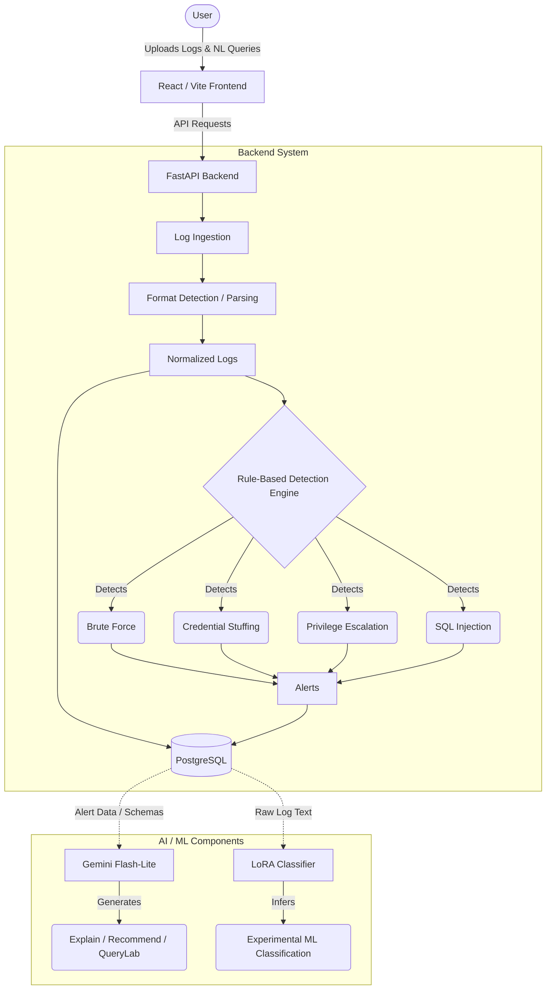

# LogHunt AI

**LogHunt AI** is an intelligent, full-stack log analysis and threat detection platform. It combines a deterministic rule-based detection engine with an experimental Machine Learning classifier (LoRA) and generative AI (Gemini) to help security analysts ingest, query, and understand log data effectively.

---

## 🎯 Key Features

### 1. Multi-Format & Mixed-Format Log Ingestion
LogHunt AI supports parsing standard server logs and can auto-detect formats on a line-by-line basis. If a file contains multiple formats, the ingestion pipeline handles it seamlessly.
- **Supported Formats**: Apache Access Logs, Syslog (including `auth.log` / `secure` without priority headers), and JSON.
- **Mixed-Format Support**: Uploading a file with a mix of Apache, Syslog, and JSON lines will parse everything it recognizes while gracefully marking unrecognized lines as failed (preserving the raw log).

### 2. Operational Threat Detection (Rule-Based)
All uploaded logs run through a deterministic rule engine that detects threats in the data and creates Alerts.
- **Brute Force (High)**: Multiple failed logins from the same IP within a configurable time window.
- **Credential Stuffing (Critical)**: Multiple failed logins followed by a successful login from the same IP.
- **Privilege Escalation (Critical)**: Detection of elevated privileges (e.g., sudo, root access).
- **SQL Injection (Critical)**: Detection of common SQL injection payloads (`UNION SELECT`, `' OR 1=1`, `pg_sleep`, etc.) and their URL-encoded variants in log messages and raw lines.

### 3. QueryLab (Natural Language to SQL)
QueryLab allows analysts to ask natural language questions (e.g., *"Show me all critical alerts"* or *"How many failed logins are there?"*), which are converted into PostgreSQL queries using the Gemini API.
- **Security Protections**: 
  - **Layer 1 (Pre-Gemini)**: Checks for destructive intent (e.g., "delete", "drop", "update", "insert") and blocks the request before it reaches the AI.
  - **Layer 2 (Post-Gemini)**: Validates the generated SQL to ensure it is a `SELECT` statement and contains no forbidden destructive keywords or malicious comments.

### 4. Incident Explanation & Recommendation
Leverages the **Gemini 3.5 Flash-Lite** model to analyze specific alerts.
- **Explain**: Translates raw log data and alert context into plain English.
- **Recommend**: Provides concrete, actionable mitigation steps for the specific threat.

### 5. Experimental ML Classifier (LoRA)
Features a fine-tuned `distilbert-base-uncased` model with a LoRA adapter (PEFT) trained on a subset of the CICIDS2017 dataset to classify threats directly from log text.
- **Evaluation F1 Scores**: Brute Force (0.97), DoS/PortScan (1.00), Normal (0.97).
- ⚠️ **SQL Injection Limitation**: The SQL Injection class has an evaluation **F1 score of 0.00** due to an extreme lack of training data (only 21 examples). Predictions for this class by the ML model are currently unreliable. (Note: The operational rule engine *does* successfully detect SQL injections).

---

## 🏗️ Architecture & Data Flow



LogHunt AI is built with a decoupled architecture:

1. **Frontend**: React + Vite + Tailwind CSS.
2. **Backend**: FastAPI (Python), handling ingestion, ML inference, and API endpoints.
3. **Database**: PostgreSQL, storing projects, logs, and alerts.
4. **AI Integration**: Google GenAI SDK communicating with Gemini (`models/gemini-3.5-flash-lite`).

**Data Flow (Ingestion):**
`Upload File` → `detect_and_parse()` → `bulk_insert_logs()` (PostgreSQL) → `Rule Engine (Brute Force, CS, PE, SQLi)` → `write_alerts()`

---

## 📂 Project Structure

```
log_analyzer/
├── backend/                  # FastAPI Backend
│   ├── app/
│   │   ├── api/              # API Route Handlers
│   │   ├── core/             # Configuration
│   │   ├── detection/        # Rule-based Threat Detection
│   │   ├── ml/               # LoRA Classifier Service & Adapter
│   │   ├── models/           # SQLAlchemy DB Models
│   │   ├── parser/           # Log Parsers (Apache, Syslog, JSON, Mixed)
│   │   ├── repositories/     # DB Access Layer
│   │   ├── schemas/          # Pydantic Schemas
│   │   └── services/         # Orchestration & Gemini Integration
│   ├── db_init.py            # Database initialization script
│   └── requirements.txt      # Python dependencies
├── frontend/                 # React + Vite Frontend
│   ├── src/
│   │   ├── components/       # UI Components (Dashboard, Logs, Alerts, QueryLab, etc.)
│   │   ├── lib/              # API wrapper & Utilities
│   │   └── App.jsx           # Main Application Router
├── sample_logs/              # Test & Demo Log Files
├── docs/                     # Additional Documentation
└── README.md                 # Project Documentation
```

---

## 🚀 Setup Instructions

### Prerequisites
- Python 3.10+
- Node.js 18+
- Docker Desktop
- A Google Gemini API Key

### 1. PostgreSQL Database Setup
LogHunt AI provides a reproducible PostgreSQL 16 database environment via Docker Compose.
1. Ensure **Docker Desktop** is installed and running.
2. From the project root directory, start the database:
```cmd
docker compose up -d
```
The PostgreSQL container will start and expose itself on `localhost:5432`. It automatically initializes the configured development database (`loghunt_db`) and user (`loghunt`).

### 2. Backend Setup
Navigate to the `backend` directory, create a virtual environment, and install dependencies.
```cmd
cd backend
python -m venv venv
venv\Scripts\activate
pip install -r requirements.txt
```

**Environment Variables:**
Copy `backend/.env.example` to `backend/.env` and add your own Gemini API key:
```cmd
copy .env.example .env
```
The example file already contains the correct default `DATABASE_URL` for the Docker Compose container. Do not commit real API keys or passwords.

**Initialize Database:**
```cmd
python db_init.py
```

### 3. Frontend Setup
Navigate to the `frontend` directory and install NPM packages.
```cmd
cd frontend
npm install
```

---

## 🏃 Running the Application

**Start the Backend (FastAPI):**
```cmd
cd backend
venv\Scripts\activate
uvicorn app.main:app --reload
```
The backend API will be available at `http://localhost:8000`.

**Start the Frontend (React):**
```cmd
cd frontend
npm run dev
```
The frontend UI will be available at `http://localhost:5173`.

---

## 🧪 Testing & Demonstration

The repository includes a `sample_logs/` directory containing various log files for testing all features.

1. **Ingestion & Detection:** Go to the Dashboard and upload `sample_logs/brute_force_sample.log` or `sample_logs/test_mixed.log`. The system will parse the logs and the rule engine will generate alerts.
2. **Alerts & Gemini:** Navigate to the **Alerts** page, click on a generated alert, and use the **Explain** or **Recommend** buttons to trigger Gemini analysis.
3. **QueryLab:** Go to **SQL Query Lab** and ask: *"How many SQL injection alerts are there?"*
4. **ML Inference:** Go to **LLM Analysis**, select a parsed log from the dropdown, and run the LoRA classifier.

---

## 📡 Major API Endpoints

- `POST /upload` - Uploads a log file, detects format, parses, inserts, and runs threat detection.
- `GET /dashboard` - Returns aggregation statistics (total logs, alerts by type, severity distribution).
- `GET /logs` - Retrieves paginated log entries.
- `GET /alerts` - Retrieves paginated alerts with filtering by type and severity.
- `POST /query` - Natural language to SQL engine.
- `GET /alerts/{id}/explain` - Generates an explanation for an alert via Gemini.
- `GET /alerts/{id}/recommend` - Generates mitigation steps via Gemini.
- `POST /classify` - Runs the LoRA classifier on a specific log entry.
- `GET /settings` / `POST /settings` - Manage dynamic thresholds for Brute Force and Credential Stuffing detection.

---

## ⚠️ Known Limitations

1. **Duplicate Upload Alert Generation**: The system does not perform content-hash deduplication across uploads. Uploading the exact same log file twice to the same project will generate a duplicate set of alerts.
2. **Experimental LoRA Classifier — SQL Injection Classification**: The experimental LoRA classifier currently achieves an F1 score of 0.00 for the SQL Injection class due to severe training-data limitations and a mismatch between the original network-flow training domain and LogHunt's application-log inference domain. Predictions for this class are therefore unreliable. This limitation does not affect operational SQL Injection detection, which is handled separately by the deterministic rule-based detection engine.
3. **No Real-time Stream Processing**: LogHunt AI is currently built for batch processing via file uploads. It does not actively tail or stream live server logs.
