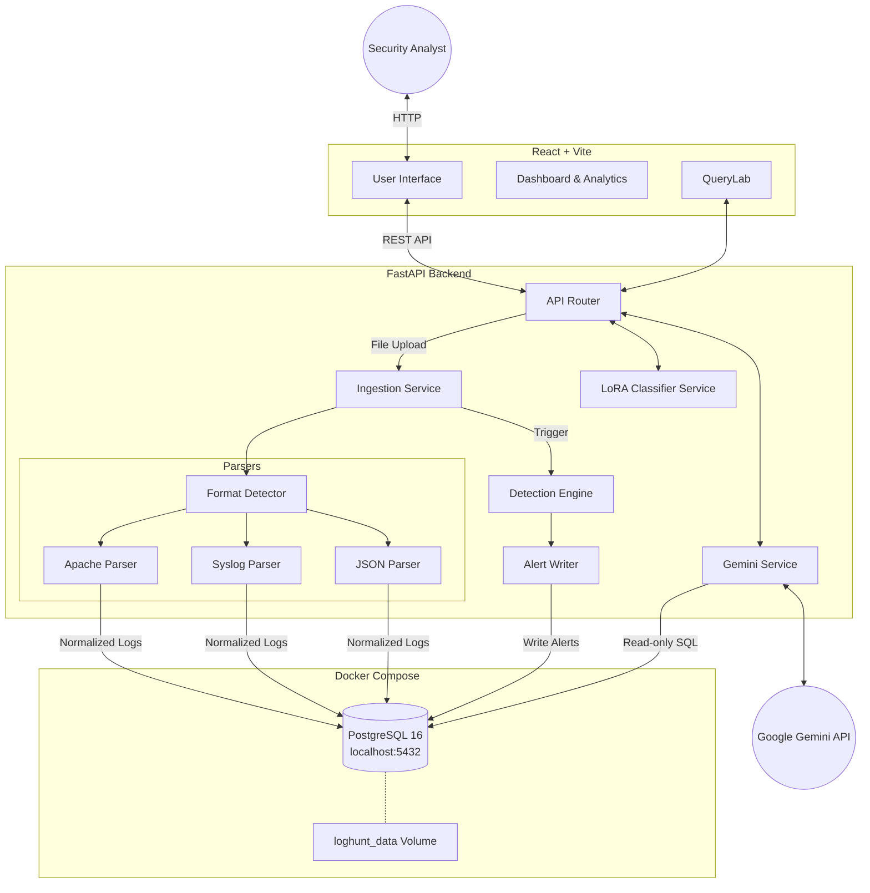
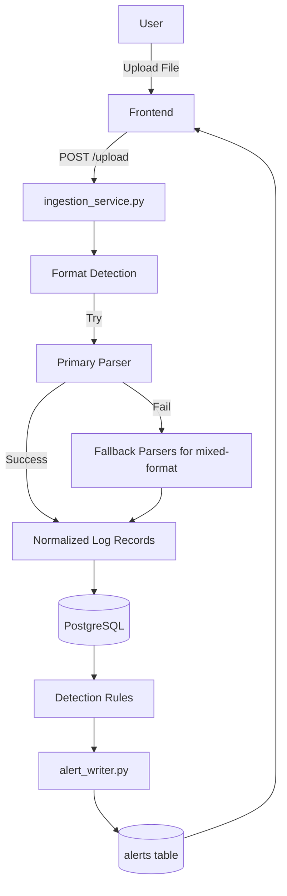
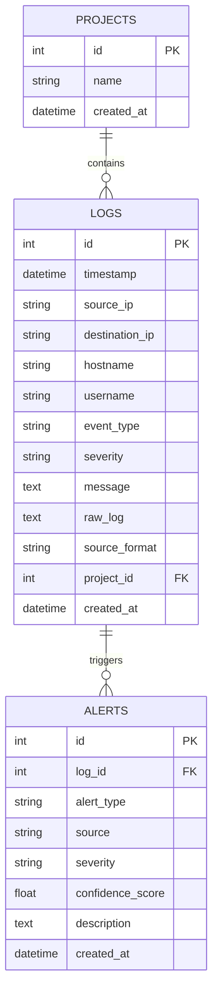

# LogHunt AI — Final Technical Documentation

## 1. Introduction & Project Overview
LogHunt AI is an advanced, AI-powered threat detection and log analysis platform designed for security analysts. It ingests application and system logs, normalizes them into a unified schema, and applies a multi-layered detection engine to identify security threats. Beyond traditional rule-based detection, LogHunt AI integrates Large Language Models (LLMs) to automatically explain alerts, recommend mitigations, and translate natural language questions into secure PostgreSQL queries.

## 2. Objectives
- Provide a unified, batch-based ingestion pipeline capable of parsing multiple log formats simultaneously.
- Provide deterministic detection for operational security threats such as Brute Force, Credential Stuffing, Privilege Escalation, and SQL Injection.
- Provide natural language interfaces for database querying (QueryLab) with robust security boundaries.
- Leverage LLMs to explain complex alerts and recommend actionable mitigations.
- Evaluate the feasibility of ML-based threat classification using LoRA adapters on modern NLP models.

## 3. System Architecture
LogHunt AI uses a modern three-tier architecture comprising a React frontend, a FastAPI backend, and a PostgreSQL database.

### High-Level Architecture


### Operational Ingestion Pipeline
The ingestion pipeline is batch-oriented; it is not a real-time streaming SIEM. 


### Database Entity-Relationship Diagram


## 4. Technology Stack
- **Frontend:** React, Vite, TailwindCSS, Recharts
- **Backend:** Python 3.10+, FastAPI, SQLAlchemy, Pydantic, python-multipart
- **Database / Infrastructure:** PostgreSQL, Docker, Docker Compose
- **AI/LLM:** Google Gemini API (`gemini-3.5-flash-lite`) via `google-genai` SDK
- **Machine Learning:** PyTorch, HuggingFace Transformers, PEFT (LoRA), DistilBERT

## 5. Repository / Project Structure
```text
C:\log_analyzer\
├── backend/
│   ├── app/
│   │   ├── api/            # API routing and endpoints
│   │   ├── core/           # Configuration and settings
│   │   ├── detection/      # Operational rule engine and alert writer
│   │   ├── ml/             # LoRA classifier and adapter weights
│   │   ├── models/         # SQLAlchemy ORM models (Project, Log, Alert)
│   │   ├── parser/         # Base parser, Format detector, Syslog/Apache/JSON parsers
│   │   ├── repositories/   # DB query abstraction
│   │   ├── services/       # Ingestion and Gemini business logic
│   │   └── utils/          
│   ├── main.py             # FastAPI application entry point
│   └── requirements.txt
├── frontend/
│   ├── src/
│   │   ├── components/     # React UI components (Dashboard, QueryLab, etc.)
│   │   ├── App.jsx         # Main routing
│   │   └── index.css       # Global styles
│   └── package.json
├── sample_logs/            # Demo datasets
├── docker-compose.yml      # PostgreSQL configuration
└── README.md
```

## 6. Log Ingestion & Parsing
- **Format Detection:** Uses sampling on the first 10 non-empty lines to score and determine the primary format.
- **Apache Parser:** Extracts IP addresses, HTTP methods, endpoints, status codes, and user-agents via regex.
- **Syslog Parser:** Supports strict RFC 3164 and PRI-less Syslog (`auth.log`). Uses an updated `_USERNAME_SUDO_RE` (`r"^(\S+)\s*:\s*(?:TTY=|PWD=|USER=)"`) to flawlessly extract usernames from `sudo` lines regardless of intermediate context.
- **JSON Parser:** Flattens generic JSON objects into standard log keys.
- **Mixed-Format Processing:** The system tries the primary parser first. If it fails to extract meaningful data, it automatically cascades through alternative parsers. This allows processing Apache and Syslog lines natively within the same physical file.
- **Log Normalization:** All parsed logs are unified into a standard PostgreSQL `logs` schema (timestamp, IPs, hostname, username, event_type, severity, message, and raw_log).

## 7. Database Architecture
The operational PostgreSQL 16 database runs inside a Docker Compose container exposed on `localhost:5432`. Data persistence is guaranteed across restarts via the configured `loghunt_data` Docker volume.
The database contains three normalized tables:
- **`projects`**: Batches of uploaded logs.
- **`logs`**: The normalized log entries, with a foreign key to `project_id`.
- **`alerts`**: Detected threats, mapping directly via foreign key (`log_id`) to the specific log line that breached the threshold.

## 8. Operational Threat Detection Engine
LogHunt AI utilizes a deterministic, rule-based detection engine for operational alerts. It scans normalized logs immediately after ingestion.

| Threat | Severity | Detection Criteria |
|---|---|---|
| **Brute Force** | High | `>= brute_force_threshold` failed logins from the same `source_ip` within the configured rolling time window. |
| **Credential Stuffing** | Critical | A successful login preceded by `>= credential_stuffing_threshold` failed logins from the SAME `source_ip` within the configured window. |
| **Privilege Escalation** | Critical | Matches privilege escalation keywords (e.g., `sudo`) AND a successfully parsed `username`. Triggers on a single occurrence. |
| **SQL Injection** | Critical | Log message or `raw_log` matches high-confidence SQL injection patterns (e.g., `UNION SELECT`, `' OR 1=1`). *Note: Relies entirely on the rule engine, not the LoRA classifier.* |

**Alert Persistence:** The `alert_writer.py` module persists detections and utilizes the `log_id` of the final triggering log in an attack burst to ensure idempotency and prevent duplicate alerts for the same event window within a project.

## 9. Gemini / Generative AI Integration
LogHunt AI utilizes `gemini-3.5-flash-lite` with exponential backoff retries.
- **QueryLab:** A natural-language-to-SQL engine. Gemini is fed the exact database schema alongside dynamically retrieved context (distinct `logs.severity`, `alerts.severity`, and `event_type` values).
- **Explain:** Generates plain-English explanations relying strictly on the specific `Alert` and `Log` factual metadata.
- **Recommend:** Generates concrete, actionable mitigation strategies based on the specific Alert Type.

### QueryLab Security Layers
Unrestricted SQL execution is blocked via two defense-in-depth safeguards:
1. **Layer 1 (Pre-Gemini Intent Guard):** A word-boundary regex blocks destructive keywords (e.g., `delete`, `drop`).
2. **Layer 2 (Post-Gemini Validation):** A strict structural validator ensures the query starts with `SELECT`, prohibits inline comments (`--`, `/*`), and blocks destructive SQL keywords. Execution is aborted if either layer fails.

## 10. Experimental ML Classifier
LogHunt AI includes an experimental threat classifier utilizing a LoRA adapter (r=16, alpha=32) over the `distilbert-base-uncased` foundational model. It operates as an asynchronous, interactive playground (`/llm-analysis`).
- **SQL Injection Limitation:** The model achieves an F1 score of 0.00 for SQL Injection. This is a verified limitation caused by severe training-data starvation (only 21 examples) and a domain mismatch between numerical CICIDS network-flow training data and LogHunt's application-level text inference.
- **Design Impact:** Due to this limitation, the classifier is strictly segregated from operational alerts. It is an analysis tool only, and low-confidence predictions (<60%) are labeled as `Uncertain`.

## 11. Frontend Architecture
The React frontend handles client-side routing, state management, and API orchestration. It relies on TailwindCSS for responsive styling and Recharts for dynamic visual analytics.

## 12. API Reference
- `POST /upload`: Bulk ingestion and format routing.
- `GET /logs`: Paginated access to normalized logs.
- `GET /alerts`: Paginated access to generated alerts.
- `GET /dashboard`: Aggregated statistics for UI visualizations.
- `POST /query`: NLP-to-SQL translation and execution.
- `GET /alerts/{alert_id}/explain`: Gemini integration for alert translation.
- `GET /alerts/{alert_id}/recommend`: Gemini integration for mitigations.
- `POST /classify`: Manual trigger of the LoRA inference engine for a specific `log_id`.

## 13. Configuration & Detection Thresholds
Detection sensitivity is dynamically configurable via `settings.json`:
- `brute_force_threshold` (default: 5)
- `brute_force_window_minutes` (default: 5)
- `credential_stuffing_threshold` (default: 3)
- `credential_stuffing_window_minutes` (default: 10)

## 14. Security Considerations
- **Local Deployment**: Designed to run locally (FastAPI + React + Docker PostgreSQL), keeping sensitive telemetry within the network perimeter.
- **API Token Security**: The Gemini API key is managed via strict backend `.env` variables.
- **No RBAC**: Role-Based Access Control and authentication are out-of-scope; the UI assumes administrative analyst access.

## 15. Testing & Verification
The system was validated using a structured test suite containing Apache access logs, Syslog authentication files, generic JSON payloads, and mixed-format files. 

The final verified demonstration state produced the following exact dataset:
- **Total Logs:** 23
- **Total Projects:** 3
- **Total Alerts:** 8
  - 4 Privilege Escalation (Critical)
  - 2 Brute Force (High)
  - 1 Credential Stuffing (Critical)
  - 1 SQL Injection (Critical)
- **Format Distribution:** 14 Syslog, 8 Apache, 1 JSON

Verification confirmed that mixed-format ingestion falls back correctly, operational rules reliably detect all 4 threats, QueryLab safely translates queries, Gemini features function properly, and the LoRA classifier executes interactively.

## 16. Final Demonstration Workflow
1. Start the PostgreSQL database: `docker compose up -d`
2. Execute backend: `uvicorn app.main:app` (with venv active).
3. Execute frontend: `npm run dev`.
4. Upload `test_mixed.log` → Validates parsing resiliency, High Brute Force, and Critical SQLi.
5. Upload `brute_force_sample.log` → Validates Syslog parsing and complex Critical Credential Stuffing detection window aggregation.
6. Upload `privilege_escalation_sample.log` → Validates deep regex extraction of `sudo` commands and generates Critical Privilege Escalation alerts.

## 17. Known Limitations
1. **LoRA SQL Injection Performance:** The ML classifier cannot reliably identify SQL injection (F1=0.00).
2. **Offline Requirements:** The Gemini features require an active internet connection.
3. **Regex Rigidity:** The Apache and Syslog parsers rely on predefined regex patterns; proprietary deviations fall back to raw log ingestion.
4. **Duplicate Uploads:** Uploading the exact same file twice generates duplicate alerts (no cross-upload deduplication).

## 18. Future Improvements
- Train a dedicated, domain-specific NLP model exclusively on application log text to solve the ML accuracy limitations.
- Implement RBAC and frontend authentication.
- Introduce streaming ingestion pipelines (e.g., Kafka) to transition from batch-upload to true real-time SIEM capabilities.

## 19. Conclusion
LogHunt AI bridges the gap between deterministic operational security and experimental AI assistance. The robust parsing pipeline and deterministic rule engine provide reliable detection for supported attack patterns and configured thresholds. Note that unknown or unsupported attack variants may not be detected by the operational engine. Simultaneously, generative AI acts as a potent force multiplier, allowing analysts to investigate identified threats and query complex schemas using natural language within a controlled, local environment.
